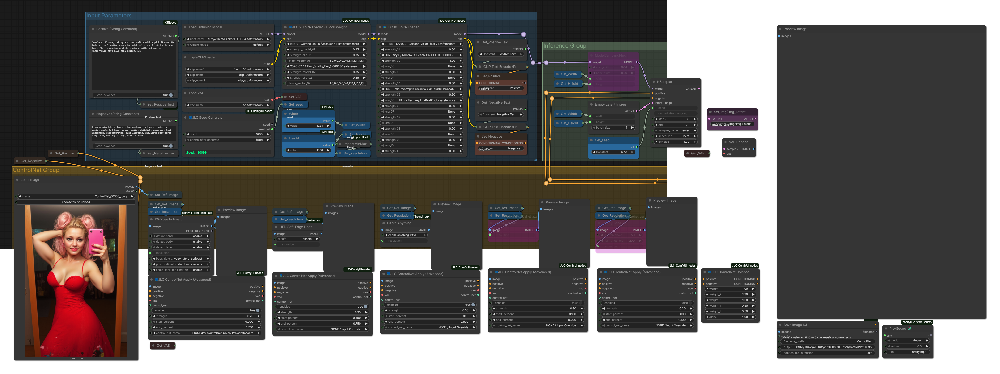

# JLC ComfyUI Nodes

<p align="center">
  
  &nbsp;&nbsp;&nbsp;
  
</p>

[](https://registry.comfy.org/packages/jlc-comfyui-nodes)
[]()
[]()


---

## Featured Node in this Release: JLC ControlNet Composition

The **JLC ControlNet Composition** node introduces an alternative execution model for ControlNet workflows.

Instead of relying on ComfyUI’s standard **recursive ControlNet chaining**, this node performs:

→ **Non-recursive, parallel aggregation of multiple ControlNets**

---

### Key Concept

#### Standard ComfyUI Behavior

ControlNets are applied via recursive chaining:

```
c_net.set_previous_controlnet(prev)
```

Execution becomes a nested evaluation during sampling:

```
ControlNet(A(ControlNet(B(ControlNet(C(...)))))
```

---

#### JLC ControlNet Composition

This node replaces recursion with **explicit parallel evaluation**:

1. Extract ControlNet chain  
2. Detach recursive links  
3. Evaluate each ControlNet independently  
4. Combine outputs via weighted accumulation  

Execution becomes:

```
sum(weight_i * ControlNet_i(x))
```

---

### Core Properties

- Fully compatible with ComfyUI (`get_control`, hooks, etc.)
- Sampler receives a **single ControlNet object**
- Internally evaluates multiple ControlNets
- No recursive traversal during sampling
- Deterministic and mutation-safe

---

### Performance Characteristics

Observed in controlled testing:

- ~2–3× speedup with 3 ControlNets  
- Reduced runtime variance  
- Stable behavior across randomized runs  

Test conditions:

- Resolution: 1024 × 1536  
- Models: 16-bit  
- Hardware: RTX 4090 Laptop (16GB)  
- Randomized ControlNet combinations and seeds  

---

### Visual Behavior

- Structural fidelity preserved (pose, depth, edges)  
- Minor local variation vs recursive baseline  
- No systematic degradation observed  

### Visual Comparison

#### Example 1

<table>
  <tr>
    <td align="center"><strong>Standard Recursive Chaining</strong></td>
    <td align="center"><strong>Non-Recursive Composition</strong></td>
  </tr>
  <tr>
    <td align="center">
      <br>
    </td>
    <td align="center">
      <br>
    </td>
  </tr>
</table>

#### Example 2

<table>
  <tr>
    <td align="center"><strong>Standard Recursive Chaining</strong></td>
    <td align="center"><strong>Non-Recursive Composition</strong></td>
  </tr>
  <tr>
    <td align="center">
      <br>
    </td>
    <td align="center">
      <br>
    </td>
  </tr>
</table>

---

## Benchmark Results

Results from controlled testing comparing recursive ControlNet chaining vs non-recursive composition.

### Test Setup

- Model: FLUX.1-dev-ControlNet-Union-PRO  
- Precision: 16-bit throughout (Flux variants, VAE, T5XXL + CLIP stack)  
- Resolution: 1024 × 1536  
- ControlNets: 3 (OpenPose + HED + Depth)  
- Sampling: CFG 2.1, 35 steps  
- Hardware: Laptop RTX 4090 (16GB)  
- Methodology: Randomized runs (mixed ordering, with/without node, repeated seeds for sanity checks)

### Raw Measurements

| Test | Recursive (sec) | Composition (sec) |
|------|----------------|-------------------|
| 1    | 668            | 349               |
| 2    | 683            | 226               |
| 3    | 1080           | 274               |
| 4    | 641            | 312               |
| 5    | 516            | 295               |
| 6    | 957            | 297               |
| 7    | —              | 298               |
| 8    | —              | 342               |

*Tests 7–8 were not completed for the recursive baseline due to excessive runtime.*

### Summary

| Metric | Recursive | Composition | Improvement |
|--------|----------|------------|-------------|
| Average Time (sec) | 757.5 | 299.1 | **2.53× faster** |
| Std Dev (sec)      | 214.1 | 38.7  | **5.5× more stable** |

Composition shows both a significant reduction in mean runtime and a substantial decrease in variance.

---

### Important Distinction

This node is **not**:

- a stacking utility  
- a UI convenience wrapper  
- a new ControlNet model  

This is a **change in execution paradigm**:

> Recursive composition → Explicit parallel aggregation

---

## Example Workflows

PNG workflows contain the embedded ComfyUI graph and can be dragged directly into the ComfyUI canvas. The png with embedded workflow generated by ComfyUI looks broken but opens correctly.

---

### ControlNet Composition (Multi-ControlNet Example)

*(Example using JLC ControlNet Composition with multiple ControlNets)*

<p align="center">
  
</p>

<p align="center">
  <a href="assets/workflows/jlc_ControlNet_Composition.png">Download PNG</a> •
  <a href="assets/workflows/jlc_Controlnet_Composition.json">Download JSON</a>
</p>

---

### ControlNet Workflow

<p align="center">
  
</p>

<p align="center">
  <a href="assets/workflows/jlc_ControlNet_Apply_Advanced.png">Download PNG</a> •
  <a href="assets/workflows/jlc_ControlNet_Apply_Advanced.json">Download JSON</a>
</p>

---

### Basic Inpainting / Outpainting Workflow Using JLC Padded Image

<p align="center">
  
</p>

<p align="center">
  <a href="assets/workflows/jlc_padded_image_Basic_Infill_Outfill.png">Download PNG</a> •
  <a href="assets/workflows/jlc_padded_image_Basic_Infill_Outfill.json">Download JSON</a>
</p>

---

### Preferred Inpainting / Outpainting Workflow Using JLC Padded Image

<p align="center">
  
</p>

<p align="center">
  <a href="assets/workflows/jlc_padded_image_Best_Infill_Outfill.png">Download PNG</a> •
  <a href="assets/workflows/jlc_padded_image_Best_Infill_Outfill.json">Download JSON</a>
</p>

---

## Table of Contents

- Installation
- Nodes Included
- Node Descriptions
- Design Philosophy
- Compatibility
- License
- Author
- Contributions

---

# Nodes Included

| Node | Purpose |
|-----|--------|
| **JLC ControlNet Composition** | Non-recursive parallel aggregation of multiple ControlNets |
| **JLC Padded Image** | Canvas preparation for inpainting and outpainting workflows |
| **JLC Padded Latent** | Combined padded-image + latent + mask conditioning pipeline |
| **JLC ControlNet Apply** | Legacy ControlNet node (simplified application) |
| **JLC ControlNet Apply (Advanced)** | Advanced ControlNet application with caching and deterministic reuse |
| **JLC 10 LoRA Loader Stack** | Sequential loader for up to 10 LoRAs |
| **JLC LoRA Loader (Block Weight)** | Multi-slot LoRA loader with block weight control |

---

# Node Descriptions

## JLC ControlNet Composition

A ControlNet node that replaces recursive chaining with **explicit parallel composition**.

### What It Does

- Accepts one or more ControlNet inputs  
- Internally detaches recursive links  
- Evaluates each ControlNet independently  
- Combines results using weighted accumulation  

### Why It Matters

Standard ControlNet chaining:

- introduces recursive execution  
- increases sampling overhead  
- creates performance variability  

This node:

- removes recursion entirely  
- stabilizes execution  
- improves performance in multi-ControlNet workflows  

### Execution Model

Instead of:

```
A(B(C(x)))
```

This node computes:

```
A(x) + B(x) + C(x)
```

(with optional weighting)

---

## JLC Padded Image
(unchanged)

## JLC Padded Latent
(unchanged)

## JLC ControlNet Apply
(unchanged)

## JLC ControlNet Apply (Advanced)
(unchanged)

## JLC 10 LoRA Loader Stack
(unchanged)

## JLC LoRA Loader (Block Weight)
(unchanged)

---

# Design Philosophy

- Workflow clarity  
- Deterministic behavior  
- Reusable building blocks  
- Clean integration with ComfyUI pipelines  

---

# Compatibility

Tested with:

- **ComfyUI**
- **Flux-based models**
- **LoRA-enabled pipelines**

---

# License

MIT License

---

# Author

**J. L. Córdova**  
https://github.com/Damkohler

---

# Contributions

Suggestions and improvements are welcome.  
Feel free to open issues or submit pull requests.