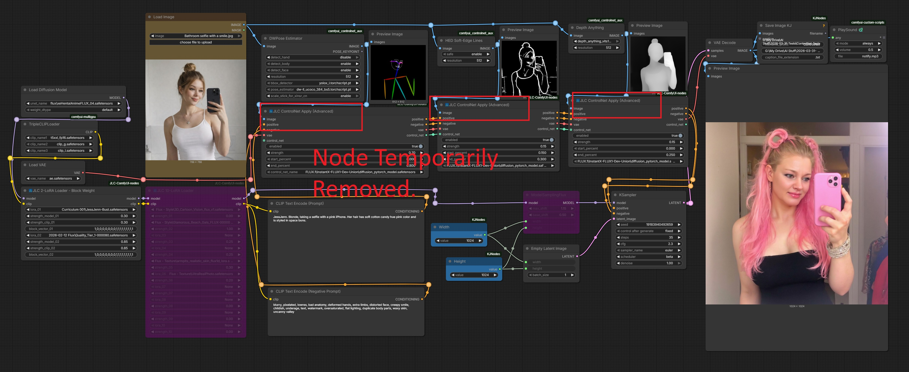

# JLC ComfyUI Nodes

<p align="center">
  
  &nbsp;&nbsp;&nbsp;
  
</p>

[](https://registry.comfy.org/packages/jlc-comfyui-nodes)
[]()
[]()


---

## ⚠️ Important Notice — ControlNet Apply (Advanced)

The **JLC ControlNet Apply (Advanced)** node has been **temporarily removed** from this repository and the ComfyUI Registry.

Initial assumptions regarding performance improvements through ControlNet chaining were incorrect.  
Controlled testing showed that chaining can significantly **increase execution time** due to conditioning complexity and memory behavior within ComfyUI.

The node will return in a future release after:

- proper instrumentation of ControlNet loading behavior
- verification of caching effectiveness
- redesign based on measured performance characteristics

---

A collection of workflow-focused ComfyUI nodes designed to simplify advanced image generation pipelines. Includes tools for flexible image padding and mask merging to enable inpainting and outpainting in a single pass, sequential LoRA stacking (up to 10 LoRAs), a two LoRA loader with block-weight control, and reusable components for Flux-based workflows and complex image generation pipelines.

Developed by **J. L. Córdova**.

These nodes are designed for:

- Flux workflows  
- LoRA experimentation  
- advanced inpainting / outpainting pipelines  
- reusable pipeline components  

Repository  
https://github.com/Damkohler/jlc-comfyui-nodes

---

## Example Workflows

PNG workflows contain the embedded ComfyUI graph and can be dragged directly into the ComfyUI canvas.

### ControlNet Workflow (Legacy / Under Review)

*Note: This workflow references a node currently under review and not included in the active release.*
<p align="center">
  
</p>

---

### Basic Inpainting / Outpainting Workflow Using JLC Padded Image

<p align="center">
  
</p>

<p align="center">
  <a href="assets/workflows/jlc_padded_image_Basic_Infill_Outfill.png">Download PNG</a> •
  <a href="assets/workflows/jlc_padded_image_Basic_Infill_Outfill.json">Download JSON</a>
</p>

---

### Preferred Inpainting / Outpainting Workflow Using JLC Padded Image

<p align="center">
  
</p>

<p align="center">
  <a href="assets/workflows/jlc_padded_image_Best_Infill_Outfill.png">Download PNG</a> •
  <a href="assets/workflows/jlc_padded_image_Best_Infill_Outfill.json">Download JSON</a>
</p>

*(Other workflows will be added later)*

---

## Table of Contents

- [Installation](#installation)
- [Nodes Included](#nodes-included)
- [Node Descriptions](#node-descriptions)
- [Design Philosophy](#design-philosophy)
- [Compatibility](#compatibility)
- [License](#license)
- [Attribution](#attribution)
- [Author](#author)
- [Future Plans](#future-plans)
- [Contributions](#contributions)

---

## Installation

### Using git:

Clone this repository into your **ComfyUI `custom_nodes` directory**.

```
ComfyUI/
└── custom_nodes/
```

Then run:

```
git clone https://github.com/Damkohler/jlc-comfyui-nodes.git
```


Restart **ComfyUI** after installation.

---

### Install via ComfyUI Manager

1. Open **ComfyUI**
2. Open **Manager**
3. Search for **JLC ComfyUI Nodes**
4. Click **Install**

---

# Nodes Included

| Node | Purpose |
|-----|--------|
| **JLC Padded Image** | Canvas preparation for inpainting and outpainting workflows |
| **JLC Padded Latent** | Combined padded-image + latent + mask conditioning pipeline |
| **JLC ControlNet Apply** | Legacy ControlNet node (simplified application) |
| ~~JLC ControlNet Apply (Advanced)~~ | *Temporarily removed (under investigation)* |
| **JLC 10 LoRA Loader Stack** | Sequential loader for up to 10 LoRAs |
| **JLC LoRA Loader (Block Weight)** | Multi-slot LoRA loader with block weight control |

---

# Node Descriptions

## JLC Padded Image

A utility node that prepares images for **inpainting or outpainting**
by placing them on a new canvas with a specified aspect ratio and size.

### Features

- Canvas resizing with aspect ratio control  
- Image placement using offset controls  
- High-quality **Lanczos resampling**  
- Automatic outpaint mask generation  
- Optional manual mask merging  
- Deterministic padding behavior  

Designed to work particularly well with inpainting models such as `flux1-fill-dev`.

---

## JLC Padded Latent

A higher-level workflow node that combines:

- padded image preparation  
- outpaint mask generation and merge with inpaint masks  
- inpaint conditioning  

### Outputs

- conditioned positive prompt  
- conditioned negative prompt  
- latent image  
- mask  
- image dimensions  

This node simplifies building **reusable inpainting pipelines**.

---

## JLC ControlNet Apply

A streamlined node for applying **ControlNet conditioning** within a generation pipeline.

### Design Goals

- simplified parameter handling  
- improved workflow clarity  
- compatibility with Flux-based pipelines  

This node adapts the built-in **ComfyUI ControlNet application logic**
for cleaner integration into custom workflows.

---

## JLC ControlNet Apply (Advanced)

**Status: Under investigation / not currently included**

Originally introduced to explore:

- model caching behavior  
- lazy loading strategies  
- flexible ControlNet routing  

However, performance assumptions were incorrect and the node is being redesigned.

---

## JLC 10 LoRA Loader Stack

Applies up to **ten LoRA models sequentially** to a base model.

### Features

Each slot includes:

- selectable LoRA file  
- independent strength control  

Slots operate independently and are applied **in order**.

Empty slots or strengths of zero are automatically skipped.

### Inspiration

Concept inspired by:

https://github.com/rgthree

---

## JLC LoRA Loader (Block Weight)

A LoRA loader with **block weight support**, allowing detailed control
over how LoRA influence is distributed across model layers.

### Features

- multiple LoRA slots  
- independent model and CLIP strengths  
- per-slot block weight vectors  
- sequential LoRA application  

Adapted from:

https://github.com/ltdrdata/ComfyUI-Inspire-Pack

---

# Design Philosophy

- Workflow clarity  
- Deterministic behavior  
- Reusable building blocks  
- Clean integration with ComfyUI pipelines  

---

# Compatibility

Tested with:

- **ComfyUI**
- **Flux-based models**
- **LoRA-enabled pipelines**

---

# License

MIT License

---

# Author

**J. L. Córdova**  
https://github.com/Damkohler

---

# Future Plans

- Reintroduce ControlNet node with validated behavior  
- Expand pipeline utilities  
- Improve instrumentation and debugging visibility  
- Continue building workflow-focused nodes  

---

# Contributions

Suggestions and improvements are welcome.  
Feel free to open issues or submit pull requests.

---