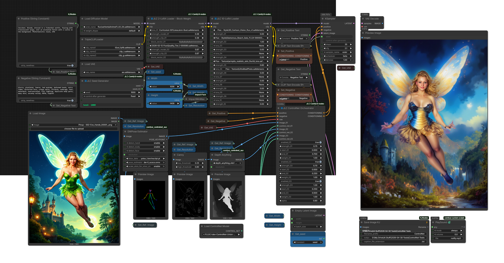
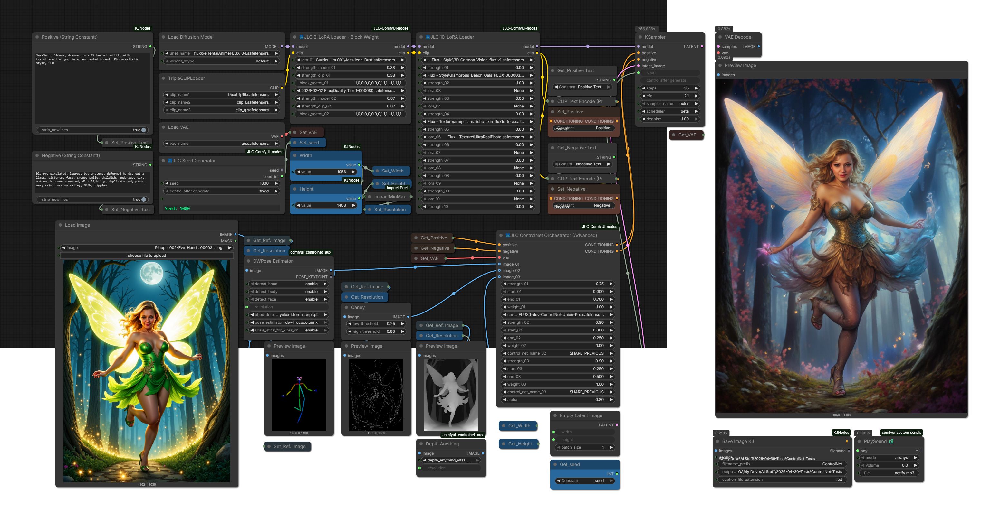

# ControlNet Composition and Orchestration

This chapter covers the JLC ControlNet node family:

- [JLC ControlNet Composition](#jlc-controlnet-composition)
- [JLC ControlNet Orchestrator](#jlc-controlnet-orchestrator)
- [JLC ControlNet Orchestrator - Advanced Dynamic](#jlc-controlnet-orchestrator---advanced-dynamic)
- [JLC ControlNet Apply](#jlc-controlnet-apply)
- [JLC ControlNet Apply - Advanced](#jlc-controlnet-apply---advanced)
- [Choosing the Right ControlNet Node](#choosing-the-right-controlnet-node)
- [Example Workflows](#example-workflows)

These nodes address two related but distinct needs:

1. **Apply ControlNet in a graph-safe, reusable way.**
2. **Experiment with non-recursive ControlNet composition for multi-ControlNet workflows.**

The Apply nodes preserve ComfyUI's native chained ControlNet model. The Composition and Orchestrator nodes provide an experimental non-recursive alternative.

---

## Core Concept

### Native ComfyUI ControlNet Chaining

ComfyUI normally applies multiple ControlNets through recursive chaining:

```python
c_net.set_previous_controlnet(prev)
```

During sampling, this behaves like a nested chain:

```text
ControlNet_A(ControlNet_B(ControlNet_C(x)))
```

This is canonical ComfyUI behavior and remains the right default for many workflows.

### JLC Non-Recursive Composition

The JLC Composition and Orchestrator nodes instead treat active ControlNets as independent operators evaluated against the same latent input, then combine their outputs:

```text
sum(weight_i * ControlNet_i(x))
```

This changes the execution paradigm:

```text
recursive chain  →  explicit parallel weighted aggregation
```

The goal is to make multi-ControlNet behavior more interpretable, reduce recursive traversal overhead, and keep active ControlNet slots isolated from each other.

### Important Status

The non-recursive nodes are experimental. They are stable in tested workflows, but they intentionally diverge from ComfyUI's canonical chained ControlNet behavior and are not guaranteed to reproduce every edge-case behavior of the native implementation.

---

## JLC ControlNet Composition

**JLC ControlNet Composition** is the standalone chain-to-composition node.

It accepts conditioning that already contains a ControlNet chain, extracts that chain, detaches recursive links without mutating the original objects, and replaces the chain with a composed ControlNet wrapper.

### What it does

1. Reads the ControlNet chain from the incoming conditioning.
2. Extracts the full chain.
3. Safely detaches recursive `previous_controlnet` links.
4. Filters inactive or zero-weight ControlNets.
5. Applies dynamic weights.
6. Uses native-style passthrough for single-ControlNet cases.
7. Uses non-recursive weighted fusion when two or more ControlNets remain.

### Composition formula

```text
combined = Σ (w_i · α^i · C_i(x))
```

where:

- `C_i(x)` is one independently evaluated ControlNet.
- `w_i` is the user-defined weight for that ControlNet.
- `α` is an optional order-bias factor.

When `alpha = 1`, the fusion is neutral with respect to the order-bias term.

### Dynamic weight slots

The node predeclares up to ten weight widgets. `slot_count` is authoritative:

- weights above `slot_count` are ignored by the backend;
- hidden values remain serialized in the workflow;
- the default visible count preserves the older five-weight behavior.

### When to use it

Use **JLC ControlNet Composition** when you already have a ControlNet chain and want to replace recursive sampling-time traversal with explicit weighted composition.

Typical pattern:

```text
ControlNet Apply / Apply Advanced chain
        ↓
JLC ControlNet Composition
        ↓
Sampler
```

---

## JLC ControlNet Orchestrator

**JLC ControlNet Orchestrator** is the external-input multi-ControlNet orchestration node.

Instead of extracting an existing chain, it accepts multiple explicit ControlNet inputs and prepares each active slot independently.

### What it does

For each active slot, the node:

1. accepts an external `CONTROL_NET` input;
2. accepts a slot image;
3. creates an isolated `.copy()` of the ControlNet;
4. applies the slot's conditioning hint;
5. gathers active slot outputs;
6. combines them with weighted additive fusion.

### Important behavior

- Active ControlNets are not recursively chained.
- Each active slot receives an isolated ControlNet copy.
- Inactive slots are bypassed before preparation.
- A single active ControlNet falls back to native Apply-style semantics.
- Slot weights can be positive, zero, or negative for controlled experimentation.

### When to use it

Use **JLC ControlNet Orchestrator** when you want explicit external ControlNet wiring and transparent slot-by-slot control.

This is useful when you prefer to keep ControlNet loader nodes visible in the graph.

---

## JLC ControlNet Orchestrator - Advanced Dynamic

**JLC ControlNet Orchestrator - Advanced Dynamic** is the compact, built-in-loader version of the orchestrator.

It replaces locally generated fixed-slot Advanced variants with one grow/shrink node.

### Dynamic slot design

The node predeclares up to ten ControlNet slots and treats `slot_count` as authoritative:

- `slot_count` is clamped to `1..10`;
- slots above `slot_count` remain serialized in workflow JSON;
- hidden slots are ignored by backend execution;
- frontend JavaScript can hide/show slot rows and image sockets;
- image inputs are lazy so inactive or hidden slots do not need to evaluate upstream preprocessors.

### Built-in ControlNet loading

Instead of requiring separate ControlNet Loader nodes, the Advanced Dynamic Orchestrator provides per-slot model selectors.

ControlNets are selected by dropdown and loaded internally.

### Shared JLC model cache

The node uses the shared JLC model cache core for resident base ControlNet models.

The default ControlNet family capacity is four resident base models. Cached base models are not used directly for sampler-facing conditioning; each active slot still uses `.copy()` isolation.

Conceptually:

```text
cached base model
      ↓ copy()
per-slot conditioned ControlNet
      ↓
non-recursive fusion
```

### Slot selector semantics

Each slot selector can be:

```text
DISABLED
SHARE_PREVIOUS
<ControlNet model name>
```

Meaning:

- **DISABLED** — hard bypass.
- **SHARE_PREVIOUS** — reuse the last valid promoted ControlNet.
- **Named model** — load or reuse the selected ControlNet through the shared cache.

Promotion occurs only after early-bypass validation, so inactive slots cannot affect downstream `SHARE_PREVIOUS` behavior.

### Early bypass conditions

A slot is bypassed when any of the following apply:

- missing image;
- zero strength;
- zero weight;
- invalid start/end interval;
- disabled selector;
- `SHARE_PREVIOUS` without a valid prior promoted model.

### When to use it

Use **JLC ControlNet Orchestrator - Advanced Dynamic** when you want a compact multi-ControlNet node with:

- built-in ControlNet selectors;
- shared model-cache reuse;
- dynamic slot visibility;
- optional `SHARE_PREVIOUS` reuse;
- fewer loader/apply nodes on the canvas.

This is the recommended JLC ControlNet orchestration node for dense workflows where graph tidiness matters.

---

## JLC ControlNet Apply

**JLC ControlNet Apply** is a daisy-chain-friendly Apply ControlNet variant.

It preserves ComfyUI's native recursive ControlNet chaining style, but adds practical workflow conveniences.

### What it does

- Applies a provided ControlNet to positive and negative conditioning.
- Preserves existing ControlNet stacks.
- Passes the `CONTROL_NET` and `VAE` forward.
- Provides an `enabled` toggle for graph-safe bypass.
- Passes through unchanged when disabled or when strength is zero.

### When to use it

Use this when you want normal chained ControlNet behavior but cleaner graph management and explicit pass-through behavior.

For non-recursive multi-ControlNet fusion, use **JLC ControlNet Composition** or one of the Orchestrator nodes instead.

---

## JLC ControlNet Apply - Advanced

**JLC ControlNet Apply - Advanced** is an Apply node with optional internal ControlNet loading.

It preserves native recursive ControlNet chaining, but adds shared-cache-backed model selection.

### ControlNet source priority

1. If an upstream `control_net` input is connected, that input is used.
2. Otherwise, the selected `control_net_name` is loaded or reused through the shared JLC model cache.
3. If neither is available, the node passes through unchanged.

### Cache behavior

- Disabled or zero-strength nodes do not load ControlNets.
- Cache entries hold resident base ControlNet models only.
- Sampler-facing ControlNets are still created with `.copy()`.
- Cached resident ControlNets may be cleaned before reuse when marked dirty.

### When to use it

Use **JLC ControlNet Apply - Advanced** when you want native chained ControlNet behavior with fewer separate loader nodes and shared resident model reuse.

---

## Shared ControlNet Composition Core

The standalone Composition node and Advanced Dynamic Orchestrator share the same composition helper.

This keeps the non-recursive fusion behavior aligned across nodes and avoids algorithm drift between the standalone chain-composition path and the slot-orchestrated path.

The shared core provides:

- weighted additive ControlNet fusion;
- best-effort ComfyUI ControlBase compatibility;
- hook forwarding;
- model reporting;
- memory requirement forwarding;
- cleanup forwarding;
- best-effort current multi-GPU clone-facing compatibility.

Multi-GPU / device-clone compatibility is best-effort and unvalidated.

---

## Choosing the Right ControlNet Node

| Need | Recommended Node |
|---|---|
| Normal native chained ControlNet behavior with explicit graph-safe bypass | JLC ControlNet Apply |
| Native chained behavior plus built-in model loading/cache reuse | JLC ControlNet Apply - Advanced |
| Convert an existing ControlNet chain into non-recursive weighted composition | JLC ControlNet Composition |
| Explicit external ControlNet slots with non-recursive fusion | JLC ControlNet Orchestrator |
| Compact multi-slot orchestration with dropdown loading, cache reuse, dynamic slot visibility, and `SHARE_PREVIOUS` | JLC ControlNet Orchestrator - Advanced Dynamic |

---

## Example Workflows

PNG workflows contain embedded ComfyUI graphs and can be dragged directly into the ComfyUI canvas.

Some ComfyUI-generated PNG files with embedded workflows may appear broken in ordinary image viewers but still load correctly in ComfyUI.

### ControlNet Composition

Placeholder for the standalone composition workflow.

```markdown


[Download PNG](../assets/workflows/jlc_ControlNet_Composition.png) ·
[Download JSON](../assets/workflows/jlc_ControlNet_Composition.json)
```

### ControlNet Orchestrator

Placeholder for the base orchestrator workflow.

```markdown


[Download PNG](../assets/workflows/JLC_ControlNet_Orchestrator_WorkFlow.png) ·
[Download JSON](../assets/workflows/JLC_ControlNet_Orchestrator_WorkFlow.json)
```

### ControlNet Orchestrator - Advanced Dynamic

Placeholder for the advanced dynamic orchestrator workflow.

```markdown


[Download PNG](../assets/workflows/JLC_ControlNet_Orchestrator_Advanced_WorkFlow.png) ·
[Download JSON](../assets/workflows/JLC_ControlNet_Orchestrator_Advanced_WorkFlow.json)
```

### ControlNet Apply - Advanced

Placeholder for the Apply Advanced workflow.

```markdown


[Download PNG](../assets/workflows/jlc_ControlNet_Apply_Advanced.png) ·
[Download JSON](../assets/workflows/jlc_ControlNet_Apply_Advanced.json)
```

### Recursive vs. Composition Comparison

Placeholder for visual comparison examples.

```markdown


```

---

## Notes for Advanced Users

### About `alpha`

`alpha` is an order-bias factor applied to the final slot weights.

For neutral fusion, use:

```text
alpha = 1.0
```

Values below or above `1.0` bias earlier or later ControlNets depending on the node and slot order. This is useful for experimentation, but `alpha = 1.0` is the easiest setting to reason about.

### About negative weights

Some JLC ControlNet nodes permit negative fusion weights. This is intended for controlled experimentation. Negative weights can invert or counteract influence and should be used deliberately.

### About cache residency

The shared JLC cache stores resident base models. It does not remove the need for per-run `.copy()` isolation. Sampler-facing ControlNet objects are still copied and conditioned separately for correctness.

### About debug output

Some ControlNet nodes intentionally print concise debug/status information. This can be useful for confirming active slots, ignored hidden slots, and shared cache residency during workflow development.
