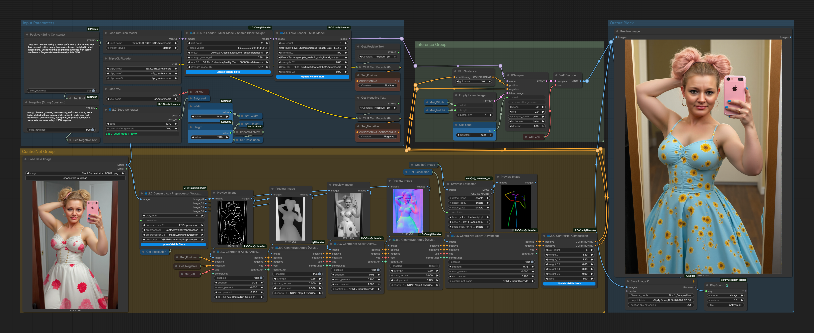

# ControlNet Composition and Orchestration

This chapter documents the JLC ControlNet family, its shared non-recursive fusion core, the supported workflow patterns, and the current ComfyUI compatibility baseline.

- [Release Status and Key Accomplishments](#release-status-and-key-accomplishments)
- [Architecture Overview](#architecture-overview)
- [Mathematical Model](#mathematical-model)
- [Shared Composition Core](#shared-composition-core)
- [JLC ControlNet Composition](#jlc-controlnet-composition)
- [JLC ControlNet Orchestrator](#jlc-controlnet-orchestrator)
- [JLC ControlNet Orchestrator (Advanced)](#jlc-controlnet-orchestrator-advanced)
- [JLC ControlNet Apply](#jlc-controlnet-apply)
- [JLC ControlNet Apply (Advanced)](#jlc-controlnet-apply-advanced)
- [Choosing the Right Workflow](#choosing-the-right-workflow)
- [VRAM Handling and Runtime Behavior](#vram-handling-and-runtime-behavior)
- [Validation Results](#validation-results)
- [Tested Compatibility Baseline](#tested-compatibility-baseline)
- [Diagnostics and Environment Controls](#diagnostics-and-environment-controls)
- [MultiGPU Scope](#multigpu-scope)
- [Troubleshooting](#troubleshooting)
- **[Example Workflows — Start Here](#example-workflows)** — downloadable workflows for users who want to begin without reading the full technical chapter
- [Future Experimental Utilities](#future-experimental-utilities)

---

## Release Status and Key Accomplishments

The current JLC ControlNet implementation has completed a substantial compatibility and performance maintenance pass.

The earlier temporary warning about recent ComfyUI sampler changes is no longer applicable. The shared composition core and the ControlNet Composition, Orchestrator, Orchestrator Advanced, and Apply Advanced paths have been audited and realigned with current ComfyUI sampler, hook, model-management, inference-memory, and lifecycle interfaces.

Compared with the prior release, the updated family provides:

- **substantially improved VRAM handling** in demanding Flux workflows;
- **markedly reduced execution time** in the tested multi-ControlNet cases;
- corrected shared-cache and per-run-copy behavior;
- current ComfyUI compatibility methods for model discovery, hooks, preparation, cleanup, and memory reporting;
- removal of mandatory per-child CUDA synchronization from the normal execution path;
- strict preflight before internal model loading in Orchestrator Advanced;
- reliable native single-ControlNet routing when composition would be mathematically redundant;
- consistent fusion mathematics across Composition and both Orchestrators;
- explicit refusal of unsupported real MultiGPU cloning instead of unsafe best-effort behavior.

The severe runtime collapse that triggered the investigation was traced primarily to launching ComfyUI with forced `--lowvram`. It was not evidence that the JLC non-recursive fusion mathematics or the synchronized repository architecture were fundamentally defective.

A separate Composition import defect was real, but it had been introduced only during the final refactor immediately before testing. Other interface and cache issues found during the audit were genuine and were corrected.

---

## Architecture Overview

The JLC family supports two execution concepts that are deliberately kept distinct.

### Native ComfyUI ControlNet chains

Native Apply-style nodes attach a new ControlNet to conditioning and connect it to any existing ControlNet through:

```python
c_net.set_previous_controlnet(prev_cnet)
```

This produces a `previous_controlnet` chain. Native ComfyUI traverses that linked structure during ControlNet evaluation.

The JLC Apply nodes preserve this native chain-building behavior.

### JLC linearized non-recursive composition

The Composition and Orchestrator nodes remove recursive linkage from the ControlNets that participate in fusion. Each prepared child is evaluated independently against the same sampler state, and the returned residual tensors are combined explicitly.

Conceptually:

```text
Native chain construction
    C1 <- C2 <- C3

JLC chain extraction and detachment
    C1    C2    C3

Independent child evaluation
    C1(x)  C2(x)  C3(x)

Explicit weighted aggregation
    W1*C1(x) + W2*C2(x) + W3*C3(x)
```

“Independent” does not mean that all children are necessarily launched concurrently. The current implementation evaluates children sequentially through one sampler-facing wrapper, but no child invokes another child recursively through `previous_controlnet`.

### Three interfaces, one fusion algorithm

The family exposes the same validated fusion implementation through three workflow styles:

1. **JLC ControlNet Composition**  
   Receives an already-built native chain, extracts it, shallow-detaches the children, and replaces the chain with the composed wrapper.

2. **JLC ControlNet Orchestrator**  
   Receives externally loaded ControlNet objects and prepares them directly as independent slots.

3. **JLC ControlNet Orchestrator (Advanced)**  
   Selects and caches ControlNet base models internally, prepares per-slot copies, and delegates to the same shared core.

Their differences concern model sourcing, workflow construction, and user interface—not the underlying fusion mathematics.

---

## Mathematical Model

For active ControlNets indexed from zero, the JLC nodes use:

```text
combined(x) = Σ [W_i · C_i(x)]
```

where:

- `C_i(x)` is the output of child ControlNet `i`, evaluated against the same latent, timestep, conditioning, batching, and transformer options;
- `W_i` is the final effective weight for that child;
- interaction between children occurs only through additive output aggregation.

For nodes that expose the order-bias parameter `alpha`:

```text
W_i = w_i · alpha^i
```

where:

- `w_i` is the user-defined slot or chain weight;
- `i` is the original zero-based slot or extracted-chain position;
- `alpha = 1.0` gives neutral order bias;
- `0 < alpha < 1.0` favors earlier positions;
- `alpha > 1.0` favors later positions;
- negative weights are supported;
- Orchestrator variants may also permit negative `alpha`, producing alternating signs by position.

Skipped or zero-weight slots retain their original positional exponent. Later slots are not renumbered simply because an earlier slot is inactive.

The shared wrapper receives final effective weights. It does not normalize, reinterpret, or redistribute them.

### What the formula does not change

The JLC fusion formula does not replace each ControlNet's native preparation or internal inference logic. Each child retains its own:

- hint image;
- strength;
- activation range;
- VAE reference where required;
- native hint preparation;
- ControlNet model architecture;
- internal preprocessing and latent-format behavior.

The JLC core changes how independently returned ControlNet outputs are aggregated.

---

## Shared Composition Core

The internal `jlc_controlnet_nonrecursive_core.py` module is the unifying mathematical and compatibility layer for the composition family.

### Prime invariants

The implementation preserves these invariants:

- never use `deepcopy`;
- never mutate upstream native ControlNet chains;
- never condition cached base ControlNet objects in place;
- use shallow copies for isolation;
- set detached children's `previous_controlnet` to `None`;
- evaluate prepared children independently;
- clone output tensors only when taking ownership;
- accumulate later outputs in place;
- expose one ControlNet-compatible object to the sampler;
- use native execution when mathematically equivalent;
- do not imply real MultiGPU support.

### Chain extraction

`extract_controlnet_chain()` traverses `previous_controlnet`, protects against malformed cycles by tracking object identity, and returns the chain in oldest-to-newest order.

That order is significant because Composition weight row 1 and exponent `alpha^0` correspond to the oldest ControlNet in the native chain.

### Shallow detachment

`make_detached_chain()` performs `copy.copy()` on each extracted ControlNet and then clears:

```python
c_copy.previous_controlnet = None
c_copy.multigpu_clones = {}
```

Shallow copying is intentional. It isolates mutable chain linkage and per-object state while retaining shared model patchers and underlying weights. A deep copy would be wasteful, potentially unsafe, and contrary to ComfyUI model ownership.

### Per-run preparation

Orchestrator nodes prepare each base ControlNet through the native-style sequence:

```python
base_controlnet.copy().set_cond_hint(
    control_hint,
    strength,
    timestep_percent_range,
    vae=vae,
)
```

Cached or externally supplied base models remain unconditioned. Hint and activation state belong only to the per-run copy.

### Streaming tensor fusion

For each child, the wrapper calls:

```python
out = cnet.get_control(
    x_noisy,
    t,
    cond,
    batched_number,
    transformer_options,
)
```

The first available output tensor is cloned when the combined result takes ownership:

```python
owned = value.clone()
owned.mul_(weight)  # when weight is not 1.0
```

Later children are accumulated directly into owned storage:

```python
dst.add_(value, alpha=weight)
```

This strategy avoids mutating child-owned output storage and avoids cloning every later output unnecessarily.

The implementation also handles:

- a child returning `None`;
- `None` entries within ControlNet output lists;
- keys introduced only by later children;
- output lists of different lengths;
- missing children;
- zero effective weights.

### Synchronization policy

The early April 2026 implementation synchronized CUDA after each child to make ownership and release behavior easier to diagnose. Mandatory synchronization is no longer part of the normal path because it can impose a substantial performance penalty and can interfere with efficient current ComfyUI/DynamicVRAM scheduling.

Per-child synchronization remains available as an opt-in diagnostic control:

```text
JLC_CONTROLNET_SYNC_AFTER_CHILD=1
```

This changes synchronization behavior, not the fusion result.

### Native fallback routing

The shared routing helper follows these rules:

| Effective active controls | Route |
|---|---|
| None | Pass conditioning thru unchanged |
| One at final weight `1.0` | Native single-ControlNet path |
| One at a non-unit weight | Composed wrapper, so the declared weight is exact |
| Two or more | Composed wrapper |

For a native single fallback, any ControlNet already attached to incoming conditioning is preserved through `set_previous_controlnet()`.

### ComfyUI compatibility surface

The composed wrapper supplies the sampler and model-management interfaces expected by the tested ComfyUI baseline:

- `previous_controlnet = None`
- `multigpu_clones = {}`
- `get_control()`
- `get_models()`
- `get_models_only_self()`
- `get_extra_hooks()`
- `get_instance_for_device()`
- `inference_memory_requirements()`
- `pre_run()`
- `cleanup()`
- `copy()`

`get_models()` aggregates child models and removes duplicates by object identity. This allows ComfyUI to manage the real child model weights even though the sampler sees one wrapper.

`get_extra_hooks()`, `pre_run()`, and `cleanup()` forward lifecycle behavior to children. Cleanup is performed once per unique child object.

`copy()` creates only a shallow wrapper copy; it does not duplicate model ownership or reconstruct a native chain.

### Inference-memory reporting

Child model weights are exposed separately through `get_models()`.

The wrapper reports the largest child temporary inference-memory requirement rather than the sum of all child scratch requirements because children are evaluated sequentially. This avoids presenting sequential temporary workspaces as though they must all exist simultaneously.

---

## JLC ControlNet Composition

**JLC ControlNet Composition** is the original cornerstone and modular interface of the JLC non-recursive architecture.

### Typical workflow

```text
JLC ControlNet Apply (Advanced)
        ↓
JLC ControlNet Apply (Advanced)
        ↓
       ...
        ↓
JLC ControlNet Composition
        ↓
      KSampler
```

Apply nodes build an ordinary native chain. Composition then extracts the chain before sampling, shallow-detaches the selected children, applies weights and order bias, and installs one composed wrapper into conditioning.

This is a first-class workflow, not a deprecated or inferior substitute for Orchestrator Advanced. It is especially useful when the graph benefits from explicit Apply stages, model pass-through, or separately controlled chain construction.

### Inputs and dynamic weights

Composition predeclares up to ten weight rows. `slot_count` is authoritative:

- chain members beyond `slot_count` are intentionally excluded;
- weight rows above `slot_count` are ignored;
- hidden widget values remain serialized in workflow JSON;
- visible non-zero rows that do not correspond to an extracted child produce diagnostic warnings when debugging is enabled.

### Chain clipping

Composition operates on the first `slot_count` members of the extracted oldest-to-newest chain.

If clipping leaves one detached ControlNet at final weight `1.0`, the node uses that detached native ControlNet directly. If the remaining effective weight is not `1.0`, the composed wrapper is retained so the user-requested scalar remains exact.

### Conditioning-row reuse

The node caches replacements by original child object identity and effective weights. Matching positive and negative conditioning rows can therefore share the same replacement wrapper instead of creating needless duplicate wrapper objects that could interfere with batching opportunities.

### Diagnostics

When debugging is enabled, Composition can report:

- extracted chain order;
- raw and effective weights;
- native or composed routing;
- chain clipping;
- chain-length/slot-count mismatch;
- unused non-zero weight rows;
- upstream conditioning rows that contain no ControlNet.

---

## JLC ControlNet Orchestrator

**JLC ControlNet Orchestrator** is the specialized external-input interface.

It accepts ControlNet objects from upstream loaders rather than selecting models from the standard ComfyUI ControlNet directory.

### Why the external-input variant remains useful

This node is appropriate when a ControlNet comes from:

- a standard loader that the user wants visible in the graph;
- a third-party or custom loader;
- a nonstandard model location;
- a dynamically modified or generated ControlNet object;
- a workflow branch that shares one loaded ControlNet with other consumers;
- a loader with specialized device, precision, or residency policy.

Orchestrator Advanced is the preferred default for ordinary registered model files, but the external Orchestrator remains a distinct specialized interface rather than a legacy duplicate.

### Execution behavior

For each active slot, the node:

1. receives an external `CONTROL_NET` object;
2. receives a hint image and slot parameters;
3. creates an isolated per-run copy;
4. applies native `set_cond_hint()` state;
5. delegates prepared children and final weights to the shared composition core.

A mathematically equivalent single ControlNet can route through the native path. Weighted singles and multiple controls use the composed wrapper.

---

## JLC ControlNet Orchestrator (Advanced)

**JLC ControlNet Orchestrator (Advanced)** is the flagship integrated interface for new multi-ControlNet workflows.

It combines dynamic slots, internal model selection, shared-cache reuse, strict preflight, per-slot preparation, and the validated non-recursive fusion core in one node.

### Dynamic slot design

The node predeclares up to ten slots. `slot_count` controls which rows are visible and authoritative:

- slots above `slot_count` remain serialized but are ignored by the backend;
- frontend JavaScript hides or reveals model, image, strength, range, and weight controls;
- hidden values are preserved for later re-expansion;
- inactive slots do not participate in model loading or composition.

### Selector semantics

Each model selector supports:

```text
DISABLED
SHARE_PREVIOUS
<registered ControlNet filename>
```

- **DISABLED** — the slot is inactive.
- **SHARE_PREVIOUS** — reuse the most recently selected registered model name.
- **Named model** — resolve the file through ComfyUI `folder_paths` and the shared JLC cache.

`SHARE_PREVIOUS` tracks the most recently selected model name. Model resolution occurs only after the complete active-slot preflight has succeeded.

### Strict preflight before model loading

The node validates all active slot wiring before touching the cache or loading model files.

A slot is inactive when:

- its selector is disabled;
- `strength == 0`;
- `weight == 0`;
- `end <= start`;
- `SHARE_PREVIOUS` has no earlier selected model.

An otherwise active slot without a connected hint image raises a clear error before any ControlNet model is loaded.

### Shared JLC cache

The shared cache stores raw base ControlNet objects only. It does not store per-run hints or chain state.

Conceptually:

```text
registered ControlNet file
        ↓ load/reuse
shared raw base ControlNet
        ↓ copy()
per-slot conditioned ControlNet
        ↓
shared non-recursive fusion core
```

The cache uses a family-scoped capacity and LRU-style policy. Repeated slots using the same model reuse the cached base and create separate conditioned copies.

The node's cache-size input can override the family capacity for that execution. A capacity of zero prevents persistent resident cached ControlNets through this policy.

### Recommended use

Use Orchestrator Advanced when you want:

- the compact integrated ControlNet workflow;
- standard ComfyUI ControlNet model dropdowns;
- model reuse through the shared JLC cache;
- `SHARE_PREVIOUS` for repeated model use;
- strict missing-hint detection before loading;
- dynamic slot visibility;
- fewer loader and Apply nodes on the canvas.

---

## JLC ControlNet Apply

**JLC ControlNet Apply** is a graph-friendly native Apply variant.

It preserves ComfyUI's `previous_controlnet` chaining behavior while adding pass-through outputs and explicit bypass behavior useful in larger workflows.

Use it when you want native recursive ControlNet execution without internal model selection.

For modular non-recursive fusion, place Composition after the completed Apply chain.

---

## JLC ControlNet Apply (Advanced)

**JLC ControlNet Apply (Advanced)** builds native ControlNet chains while supporting either an upstream ControlNet input or internal dropdown loading through the shared JLC cache.

### Source priority

1. A connected upstream `control_net` input wins.
2. Otherwise, a selected dropdown model is loaded or reused from the shared cache.
3. If neither source is available, conditioning passes through unchanged.

The upstream input path is intentionally not registered into the JLC cache. It may represent an externally owned or specialized ControlNet object.

### Hard bypass

The node returns before dropdown resolution or model loading when:

- `enabled` is false; or
- `strength == 0`.

This prevents disabled chain stages from loading models unnecessarily.

### Cache and copy discipline

The cache owns only the raw base ControlNet. For every distinct previous-ControlNet identity in conditioning, Apply Advanced creates a per-run copy, calls `set_cond_hint()`, and reconnects the native chain with `set_previous_controlnet(prev_cnet)`.

The same prepared copy is reused between matching positive and negative conditioning rows.

The node returns positive conditioning, negative conditioning, VAE, and the base ControlNet object, which makes daisy-chain and explicit reuse patterns practical.

### Relationship to Composition

Apply Advanced itself does not perform non-recursive fusion. It intentionally constructs a native chain.

Composition is the stage that extracts and linearizes that chain into independent weighted execution.

---

## Choosing the Right Workflow

| Need | Recommended node or pattern |
|---|---|
| Compact integrated multi-ControlNet workflow using standard registered model files | **JLC ControlNet Orchestrator (Advanced)** |
| Explicit modular chain construction followed by the same validated fusion math | **Apply Advanced → ... → Composition** |
| ControlNets supplied by third-party, custom, shared, or nonstandard-location loaders | **JLC ControlNet Orchestrator** |
| Native recursive ControlNet behavior with a connected external ControlNet | **JLC ControlNet Apply** |
| Native recursive behavior with optional internal loading and shared-cache reuse | **JLC ControlNet Apply (Advanced)** |
| Convert an existing native chain into explicit weighted non-recursive fusion | **JLC ControlNet Composition** |

### Product positioning

- **Orchestrator Advanced** is the flagship integrated interface.
- **Composition** is the original cornerstone and first-class modular interface.
- **Orchestrator** is the specialized external-input interface.
- **Apply Advanced** is both a useful native Apply node and the natural chain builder for modular Composition workflows.

No interface is declared mathematically superior. Composition and both Orchestrators converge on the same shared fusion implementation.

---

## VRAM Handling and Runtime Behavior

### What improved

The current release demonstrates substantially improved VRAM handling compared with the prior release. The improvement is broader than a smaller static model footprint.

The revised nodes now coordinate more correctly with ComfyUI's current model-management architecture by:

- exposing all unique child models through `get_models()`;
- forwarding hooks and lifecycle calls;
- reporting sequential scratch requirements appropriately;
- keeping cached bases free of per-run conditioning state;
- avoiding `deepcopy`;
- cloning only output tensors whose ownership is transferred;
- accumulating later outputs in place;
- avoiding forced CUDA synchronization by default;
- performing Orchestrator Advanced preflight before model loading;
- allowing DynamicVRAM to manage real model residency instead of imposing a competing JLC policy.

### Staged size is not physical residency

ComfyUI/DynamicVRAM logs may report model sizes such as:

```text
Model ControlNetFlux prepared ... 6297MB Staged
Model Flux prepared ... 22700MB Staged
```

These staged amounts must not be added and interpreted as simultaneous physical VRAM occupancy. They describe model material prepared for dynamic loading and patching. DynamicVRAM can keep only the required working portions resident while the logical staged model set is much larger than physical VRAM.

### Lazy ControlNet hint preparation

Native `ControlNet.get_control()` prepares `cond_hint` lazily. Flux ControlNets may invoke AutoencodingEngine/VAE encoding when a control first becomes active.

This means a ControlNet activation boundary can legitimately coincide with:

- ControlNet hint preprocessing;
- VAE or AutoencodingEngine preparation;
- latent-format conversion;
- additional model-management decisions.

In normal VRAM mode with DynamicVRAM, the validated workflows handled these events without catastrophic model eviction.

### Why forced `--lowvram` was harmful in the tested workflow

Under forced `--lowvram`, the same activation and hint-preparation events triggered destructive partial unload/reload cycles and deferred LoRA weight-patch handling. The result was severe and highly variable runtime degradation.

“Low-VRAM patches” in ComfyUI logs are deferred weight-patch functions used when LoRA-modified parameters are offloaded. They are not ordinary source-code patches, and their presence is not equivalent to simple model offload.

For the tested RTX 4090 Laptop 16 GB Flux workflow:

- use normal ComfyUI VRAM behavior;
- DynamicVRAM may be enabled;
- do not force `--lowvram` unless a separate controlled test demonstrates a need.

### ControlNet model size observations

Representative model sizes from the investigation were:

- Shakker fp8 Union ControlNet: approximately **3.15 GB**;
- Union Pro ControlNet: approximately **6.3 GB**.

The smaller Shakker model naturally provides more headroom. Earlier speed comparisons between these models were contaminated by forced low-VRAM behavior and are now understood not to be clean architectural benchmarks.

---

## Validation Results

The following results are workflow-specific evidence, not universal performance guarantees. They demonstrate that the current architecture can execute demanding Flux workloads efficiently on a 16 GB GPU when ComfyUI is allowed to manage residency normally.

### Benchmark workflow: Union Pro with standard heavy Flux base

Representative log characteristics:

| Item | Result |
|---|---:|
| ControlNetFlux staged size | 6,297 MB |
| Flux staged size | 11,350 MB |
| Attached LoRA patches | 304 |
| Sampling steps | 35 |
| Sampling time | approximately 188 s |
| Total prompt time | 197.97 s |
| Model unload events during sampling | 0 |

The workflow used the modular Apply Advanced → Composition path and completed faster and more efficiently than its prior-release behavior.

### Heavier base-model case: `FLUX_SRPO_bf16`

The toolchain and benchmark case were kept otherwise consistent while replacing the base model with one of the heaviest Flux1 models routinely used by the developer.

| Item | Result |
|---|---:|
| ControlNetFlux staged size | 6,297 MB |
| Flux staged size | 22,700 MB |
| Attached LoRA patches | 304 |
| Sampling steps | 35 |
| Sampling time | approximately 202 s |
| Total prompt time | 224.63 s |
| Model unload events during sampling | 0 |

Although the staged Flux size approximately doubled, total runtime increased by only about 26.7 seconds relative to the earlier case. AutoencodingEngine preparation occurred afterward without triggering a destructive model unload cycle.

### Orchestrator Advanced stress testing

Additional overnight Orchestrator Advanced cases included:

- more LoRAs;
- repeated and distinct ControlNet models;
- as many as four ControlNet uses;
- demanding Flux workflows on the same 16 GB GPU.

Performance remained steady at similar speeds, supporting the conclusion that the current behavior is architectural rather than an isolated successful run.

### Interpreting the improvement

Earlier forced-low-VRAM cases ranged from approximately 12 minutes to extreme multi-hour behavior in pathological configurations. Those results are not a clean direct benchmark against the current release because runtime mode was the dominant confounding variable.

The defensible conclusion is:

> In the tested workflows, internal optimizations and current ComfyUI integration produced substantially better VRAM handling and markedly lower, more stable execution time than the prior release and forced-low-VRAM test state.

---

## Tested Compatibility Baseline

The current JLC ControlNet implementation was validated against:

- **ComfyUI tag relation:** `v0.25.0-34-g2a61015`
- **ComfyUI commit:** `2a610155821d670a2d8047e654e5fce96b790eb5`
- **Commit date:** June 22, 2026
- **Commit message:** `feat: Support Krea2 (#14589)`
- **ComfyUI frontend package:** `1.45.19`
- **Python:** `3.10.11`
- **PyTorch:** `2.9.1+cu130`
- **CUDA runtime reported by PyTorch:** `13.0`
- **Test GPU:** NVIDIA RTX 4090 Laptop GPU with 16 GB VRAM
- **Runtime configuration:** normal ComfyUI VRAM mode with DynamicVRAM enabled; forced `--lowvram` was not used

The local Git worktree reported that the tested tracked ComfyUI source corresponded to commit `2a610155821d670a2d8047e654e5fce96b790eb5`.

Compatibility with later ComfyUI revisions may require renewed testing if sampler, ControlNet, model-management, hook, MultiGPU, or lifecycle interfaces change.

---

## Diagnostics and Environment Controls

The shared core is quiet by default.

### Enable JLC ControlNet diagnostics

Set before launching ComfyUI:

```powershell
$env:JLC_CONTROLNET_DEBUG = "1"
```

Diagnostics may include:

- active and inactive slot decisions;
- extracted chain order;
- raw and effective weights;
- native, composed, or passthrough routing;
- cache loading and reuse;
- first child evaluation;
- chain-length mismatch warnings.

### Enable per-child CUDA synchronization

For controlled diagnostic comparison only:

```powershell
$env:JLC_CONTROLNET_SYNC_AFTER_CHILD = "1"
```

This restores explicit synchronization after each child evaluation. It may significantly reduce performance and is not recommended as the normal setting.

### Clear variables in PowerShell

```powershell
Remove-Item Env:JLC_CONTROLNET_DEBUG -ErrorAction SilentlyContinue
Remove-Item Env:JLC_CONTROLNET_SYNC_AFTER_CHILD -ErrorAction SilentlyContinue
```

Restart ComfyUI after changing these environment variables.

---

## MultiGPU Scope

The JLC composed wrapper does **not** implement real MultiGPU ControlNet cloning.

The following are compatibility shunts for current single-device ComfyUI interfaces:

```python
previous_controlnet = None
multigpu_clones = {}
```

`get_instance_for_device()` returns the current wrapper for ordinary single-device use.

`deepclone_multigpu()` raises a clear runtime error rather than pretending to create valid per-device model ownership.

Do not interpret the presence of MultiGPU-related attributes as validated MultiGPU support. Real MultiGPU behavior would require a separately designed and tested implementation, which the developer cannot support or test due to personal hardware limitations.
> **Hardware note:** The developer would gladly design and test proper MultiGPU
> support if suitable multi-GPU hardware is donated to the cause. Until such a
> test bench exists, MultiGPU behavior will not be advertised on optimism alone.

---

## Troubleshooting

### Execution suddenly takes far longer than expected

Check the ComfyUI launch command first.

For the tested 16 GB Flux workflow, remove forced:

```text
--lowvram
```

Then retest in normal VRAM mode. DynamicVRAM may remain enabled.

### Orchestrator Advanced reports a missing image

The node performs strict preflight. A slot with a selected model, meaningful strength, meaningful weight, and a non-empty range must have a connected hint image.

Either:

- connect the image;
- set the selector to `DISABLED`;
- set strength or weight to zero;
- use an empty activation range.

### `SHARE_PREVIOUS` does not resolve

A preceding slot must have selected a named ControlNet model. Slot 1 cannot share a model that has not yet been selected.

### Composition warns about unused weight rows

The extracted native chain is shorter than the visible non-zero weight rows. Check upstream Apply nodes, disabled toggles, zero strengths, and whether conditioning actually reaches Composition.

### Composition ignores later upstream controls

`slot_count` is lower than the extracted chain length. Increase `slot_count` to include additional oldest-to-newest chain members.

### One ControlNet appears to bypass composition

A single effective ControlNet at final weight `1.0` intentionally routes through the mathematically equivalent native path. This is an optimization, not a lost control.

### A custom ControlNet is not listed in Orchestrator Advanced

Orchestrator Advanced uses ComfyUI's registered `controlnet` model paths. Use the external-input **JLC ControlNet Orchestrator** with the appropriate custom or third-party loader when the model is not exposed through that registry.

### MultiGPU error

The composed wrapper intentionally refuses real MultiGPU cloning. Use a single-device workflow for JLC non-recursive composition unless explicit support is added later.

---

## Example Workflows

PNG workflows contain embedded ComfyUI graphs and may be dragged directly onto the canvas. JSON versions are useful as explicit backups.

Some ComfyUI-generated PNG workflows may appear unusual or broken in ordinary image viewers while still loading correctly in ComfyUI.

### Release showcase: Orchestrator Advanced workflow

Orchestrator Advanced does not use external model loaders or Apply ControlNet nodes. 


[Download PNG](../assets/workflows/Release_2.0/jlc_Orchestrator_Advanced_Workflow.png)
[Download JSON](../assets/workflows/Release_2.0/jlc_Orchestrator_Advanced_Workflow.json)

### Composition modular workflow

ControlNet Apply Advanced → ControlNet Apply Advanced → ... → ControlNet Apply Advanced → Composition



[Download PNG](../assets/workflows/Release_2.0/jlc_ControlNet_Composition.png)
[Download JSON](../assets/workflows/Release_2.0/jlc_ControlNet_Composition.json)

---

### JLC ControlNet Hint Prewarm

**JLC ControlNet Hint Prewarm** remains an experimental research utility for moving latent ControlNet hint preparation and VAE encoding ahead of denoising.

It is not required for normal operation, is not expected to improve workflows that already run cleanly under normal ComfyUI VRAM management, and should not be treated as a general-purpose VRAM rescue mechanism.

The concept may become useful in unusually large or high-resolution workflows where delayed ControlNet activation
causes disruptive AutoencodingEngine or VAE loading during sampling. Any future version must remain closely aligned with
ComfyUI's native hint-preparation behavior, including exactly:

- target dimensions;
- compression ratio;
- VAE spatial compression;
- upscale and crop behavior;
- `preprocess_image`;
- VAE encoding;
- `latent_format.process_in`;
- `extra_concat`;
- batch broadcasting;
- final device and dtype selection;
- `manual_cast_dtype`, including bfloat16 where required.

An early prototype found in an .experimental/ folder is not suitable for use because it retains prepared hints in float16 where native ControlNetFlux expects bfloat16.

Any future Hint Prewarm node should be treated as an optional spike-control experiment, not as a VRAM rescue mechanism. The current validated workflows do not require it for acceptable performance.

---

## Summary

The JLC ControlNet family now provides two equally valid primary workflows over one hardened mathematical core:

- **Orchestrator Advanced** for compact integrated model selection and orchestration;
- **Apply Advanced → Composition** for explicit modular chain construction and conversion.

The external-input Orchestrator preserves specialized loader flexibility, while the Apply nodes continue to support native ComfyUI chaining.

The defining implementation remains conservative:

```text
extract or prepare isolated children
        ↓
evaluate each child independently
        ↓
clone only when taking ownership
        ↓
accumulate later outputs in place
        ↓
expose one compatible wrapper to the sampler
```

The validated result is not merely corrected output math. It is a composition family aligned with current ComfyUI architecture, capable of much better VRAM handling and substantially lower, more stable execution time than the prior release in the tested Flux and multi-ControlNet workloads.
