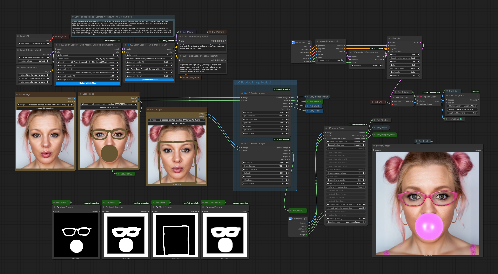

# Padded Image / Padded Latent

This chapter covers the JLC padded-canvas nodes:

- [JLC Padded Image](#jlc-padded-image)
- [JLC Inpaint-Conditioned Padded Latent](#jlc-inpaint-conditioned-padded-latent)
- [Choosing the Right Padded Node](#choosing-the-right-padded-node)
- [Workflow Notes](#workflow-notes)
- [Example Workflows](#example-workflows)

These nodes are designed for inpainting and outpainting workflows where an input image needs to be placed on a new canvas, optionally scaled, offset, feathered, and paired with an aligned editable mask.

---

## Core Concept

Inpainting and outpainting workflows often need two separate steps:

1. **Canvas preparation** — place the source image on a larger or differently shaped canvas and create a mask for the new/editable regions.
2. **Inpaint conditioning** — encode the prepared image and attach the conditioning fields expected by inpaint-aware diffusion workflows.

The JLC padded nodes split that problem into two levels:

```text
JLC Padded Image   = canvas + mask preparation
JLC Padded Latent  = canvas + mask preparation + VAE encode + inpaint conditioning
```

Use the modular node when you want to keep later encoding and conditioning explicit. Use the integrated node when you want the node to carry the inpaint-conditioning setup for you.

---

## JLC Padded Image

**JLC Padded Image** is the canvas-builder node.

It prepares an input image for inpainting or outpainting by placing a scaled version of the image onto a new canvas and generating a matching editable mask.

### What it does

The node allows the user to define:

- target canvas size;
- target canvas aspect ratio;
- scale factor for the original image;
- horizontal and vertical placement offsets;
- feathering around the preserved image region;
- seam-fix mask growth;
- optional manual mask union.

The padded regions of the new canvas are marked as editable in the generated mask. If a manual mask is provided, the node aligns that mask to the scaled image region and unions it with the generated padding/outpaint mask.

### Inputs

Important inputs include:

| Input | Purpose |
|---|---|
| `image` | Source image to place on the new canvas. |
| `scaleFac` | Relative scale of the source image within the new canvas. |
| `maxCanvas` | Maximum target canvas dimension. |
| `newAspectRat` | Target canvas aspect ratio using standard width:height labels such as `16:9`, `1:1`, or `3:4`. |
| `offsetX` | Horizontal placement of the scaled image, from left to right. |
| `offsetY` | Vertical placement of the scaled image, from top to bottom. |
| `feathering` | Softens the transition between preserved image and editable mask. |
| `seamFixPx` | Expands the editable mask region slightly to reduce seam/border artifacts in noise-mask workflows. |
| `mask` | Optional manual mask to align and union with the generated padding mask. |

### Outputs

| Output | Purpose |
|---|---|
| `Padded Image` | The source image placed on the new canvas. |
| `Mask` | Editable mask aligned to the padded canvas. |
| `Width` | Output canvas width. |
| `Height` | Output canvas height. |
| `Padded?` | Boolean flag indicating whether padding was actually applied. |

### Aspect-ratio convention

The user-facing aspect-ratio labels use standard width:height notation.

For example:

```text
16:9 = wide
9:16 = tall
3:4  = portrait
```

Internally, the node converts those labels to the ratio needed by the placement/scaling math.

### When to use it

Use **JLC Padded Image** when you want a clean, modular canvas-preparation step.

Typical downstream choices include:

- VAE Encode;
- inpaint conditioning nodes;
- custom conditioning logic;
- ControlNet preprocessing;
- preview/debug workflows where you want to inspect the padded image and mask before sampling.

This is usually the better choice when you want maximum transparency and do not want the padded node to also manage conditioning.

---

## JLC Inpaint-Conditioned Padded Latent

**JLC Inpaint-Conditioned Padded Latent** is the integrated inpaint-conditioning node.

It combines the padded-image canvas logic with VAE encoding and inpaint-conditioning preparation.

### What it does

The node:

1. runs the same padding, placement, and mask-generation logic used by **JLC Padded Image**;
2. optionally unions the generated padding mask with a user-provided mask;
3. creates the inpaint-ready latent using the provided VAE;
4. creates the inpaint-conditioning fields used by compatible diffusion pipelines;
5. optionally attaches a `noise_mask` to the latent;
6. returns conditioned positive and negative conditioning, latent, mask, dimensions, and debug outputs.

### Conditioning behavior

The node follows the field conventions used by ComfyUI's inpaint conditioning flow.

It prepares and attaches:

```text
concat_latent_image
concat_mask
noise_mask
```

The positive and negative conditioning outputs are therefore already modified for the inpaint path.

### Inputs

The canvas-related inputs mirror **JLC Padded Image**:

| Input | Purpose |
|---|---|
| `positive` | Incoming positive conditioning. |
| `negative` | Incoming negative conditioning. |
| `vae` | VAE used to encode the padded image. |
| `image` | Source image to place on the new canvas. |
| `scaleFac` | Relative scale of the source image within the new canvas. |
| `maxCanvas` | Maximum target canvas dimension. |
| `newAspectRat` | Target canvas aspect ratio. |
| `offsetX` | Horizontal placement of the scaled image. |
| `offsetY` | Vertical placement of the scaled image. |
| `feathering` | Softens the editable mask transition. |
| `seamFixPx` | Expands the editable region to help reduce seam artifacts. |
| `noise_mask` | Whether to attach the generated mask as the latent noise mask. |
| `mask` | Optional manual mask to union with the generated padding/outpaint mask. |

### Outputs

| Output | Purpose |
|---|---|
| `positive` | Positive conditioning with inpaint metadata attached. |
| `negative` | Negative conditioning with inpaint metadata attached. |
| `latent` | Prepared latent dictionary. |
| `mask` | Unified padded/manual mask. |
| `width` | Output canvas width. |
| `height` | Output canvas height. |
| `padded_image` | Debug/inspection image showing the padded canvas. |
| `padded?` | Boolean flag indicating whether padding was applied. |

### When to use it

Use **JLC Inpaint-Conditioned Padded Latent** when you want the padded node to produce a ready-to-sample inpaint latent and conditioned positive/negative streams.

This is convenient when your workflow expects the node to handle the canvas, mask, VAE encoding, and inpaint-conditioning setup as one bundled step.

---

## Choosing the Right Padded Node

| Need | Recommended Node |
|---|---|
| Prepare padded canvas and aligned mask only | JLC Padded Image |
| Inspect or debug the padded image/mask before choosing the conditioning path | JLC Padded Image |
| Use a separate VAE Encode or custom inpaint-conditioning setup | JLC Padded Image |
| Produce conditioned positive/negative streams and a ready latent in one node | JLC Inpaint-Conditioned Padded Latent |
| Avoid duplicated inpaint-conditioning fields elsewhere in the graph | Use Padded Image, or make sure Padded Latent is the only node adding that conditioning |

### Important overlap note

**Padded Latent overlaps with inpaint-conditioning nodes.**

Do not stack **JLC Inpaint-Conditioned Padded Latent** with another node that also adds the same inpaint-conditioning fields unless you intentionally want that behavior and understand the graph.

A simple rule:

```text
Use Padded Image when you want canvas/mask preparation only.
Use Padded Latent when you want canvas/mask preparation plus inpaint conditioning.
```

---

## Workflow Notes

### Outpainting

For outpainting, reduce `scaleFac` so the source image occupies less than the full target canvas. The padded area becomes the editable mask region.

Examples:

```text
scaleFac = 0.70
newAspectRat = 16:9
offsetX = 0.5
offsetY = 0.5
```

This places the image centered on a wider canvas and marks the new side regions as editable.

### Directional expansion

Use `offsetX` and `offsetY` to bias the preserved image toward one side of the canvas.

Examples:

```text
offsetX = 0.0  → image placed left, editable region mostly right
offsetX = 1.0  → image placed right, editable region mostly left
offsetY = 0.0  → image placed top, editable region mostly below
offsetY = 1.0  → image placed bottom, editable region mostly above
```

### Mask feathering

Use `feathering` to soften the boundary between preserved and editable regions.

Higher values create a broader transition. Lower values produce a sharper mask.

### Seam fix

`seamFixPx` grows the white/editable mask region. This can help repaint the transition band near the original image border and reduce visible seams in workflows that use `noise_mask`.

### Manual mask union

If a manual mask is provided, it is resized to the scaled image area, placed at the same offset as the source image, and unioned with the generated padding mask.

This lets one workflow handle both:

```text
outpaint the new canvas area
+
edit a selected region inside the original image
```

---

## Example Workflows

Detailed padded-image workflow examples will be added shortly.

Planned examples:

- Basic inpainting / outpainting with **JLC Padded Image**
- Preferred modular workflow using **JLC Padded Image**
- Integrated conditioning workflow using **JLC Inpaint-Conditioned Padded Latent**

Existing workflow asset placeholders:



[Download PNG](../assets/workflows/Release_2.0/jlc_Padded_Image_Infill_Outfill.png) ·
[Download JSON](../assets/workflows/Release_2.0/jlc_Padded_Image_Infill_Outfill.json)


---

## Notes for Advanced Users

### Canvas dimensions

The output dimensions are rounded down to multiples of eight to stay compatible with latent-grid workflows.

### Data types

The padded image and mask outputs are returned as tensors suitable for ComfyUI image/mask workflows.

### Empty masks

An optional manual mask that is effectively empty is ignored, preserving the generated padding-mask behavior.

### `noise_mask`

When `noise_mask` is enabled in **JLC Inpaint-Conditioned Padded Latent**, the generated mask is attached to the latent dictionary. This usually focuses sampling inside the editable region, but the best behavior can vary by model and workflow.

### Bundled vs. modular graph design

**JLC Padded Image** is more modular. **JLC Inpaint-Conditioned Padded Latent** is more bundled.

The modular node is often easier to reason about when combining multiple conditioning systems. The bundled node is convenient when the desired inpaint-conditioning path is exactly the one it prepares.
